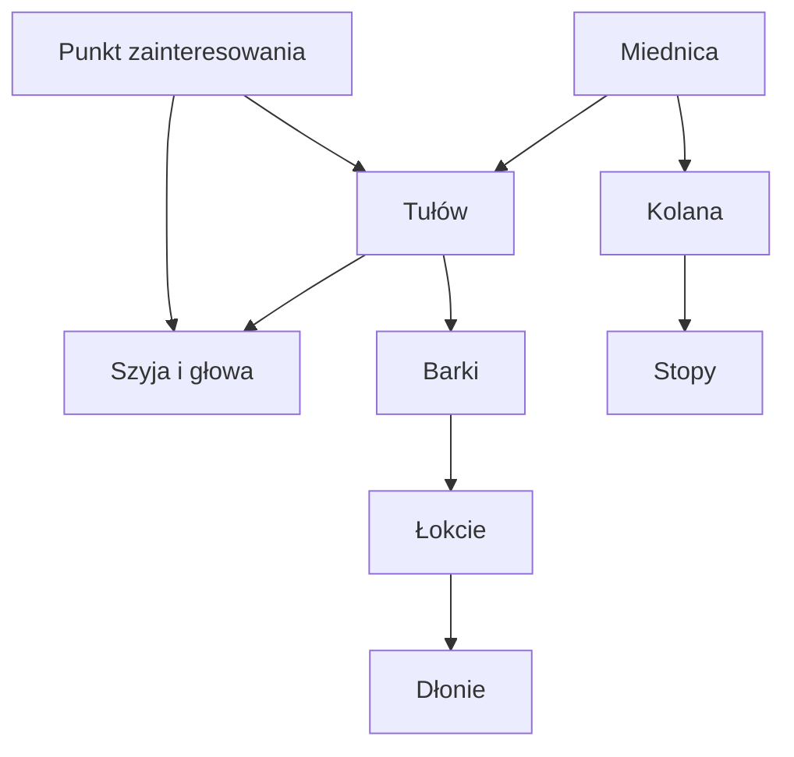

# PoseBound

Interaktywny prototyp naturalnego ruchu postaci 2D. Użytkownik przeciąga pięć punktów sterujących, a lekki model kinematyki odwrotnej (IK) przelicza położenie zależnych części ciała i blokuje ustawienia wychodzące poza zdefiniowane granice.

## Co działa w MVP

- przeciąganie głowy, obu dłoni, miednicy i punktu zainteresowania,
- dwusegmentowy model IK dla ramion i nóg,
- ograniczenie zasięgu ramion, szyi, miednicy, pochylenia tułowia i wzroku,
- podgląd szkieletu, kątów, zakresów oraz przyczyny korekty,
- delikatne podążanie wzrokiem i tułowiem za kursorem,
- przywracanie pozycji neutralnej,
- zapis aktualnej pozy do pliku JSON,
- obsługa urządzeń dotykowych i `prefers-reduced-motion`.

## Model ruchu



Każda dłoń jest końcem łańcucha złożonego z ramienia i przedramienia. Położenie łokcia wynika z przecięcia dwóch zasięgów. Jeśli cel znajduje się zbyt daleko, dłoń zostaje zatrzymana na maksymalnym promieniu. Analogiczny model stabilizuje kolana, podczas gdy stopy pozostają zakotwiczone.

## Uruchomienie

```bash
npm run install:ci
npm run dev
```

Wersję produkcyjną sprawdzisz poleceniem `npm run build`. Projekt nie wymaga backendu.

## Publikacja na GitHub Pages

Workflow w `.github/workflows/deploy-pages.yml` buduje statyczną wersję po każdym pushu do gałęzi `main`. W ustawieniach repozytorium wybierz **Settings → Pages → Source → GitHub Actions**.

## Format pozy

Przykładowy zapis znajduje się w `examples/neutral-pose.json`. Plik przechowuje współrzędne pięciu kontrolerów oraz zestaw ograniczeń użyty podczas eksportu.

## Ograniczenia pierwszej wersji

- tylko widok z przodu; obrót wymaga osobnych wariantów sylwetki,
- uproszczone kształty zamiast warstw ilustracji produkcyjnej,
- stopy są zakotwiczone, bez modelu równowagi i przenoszenia ciężaru,
- brak importu zapisanej pozy oraz interpolacji między pozami,
- limity są wspólne dla jednej sylwetki i nie mają jeszcze edytora.

## Decyzje autorskie podjęte przy wsparciu AI

Samodzielnie określiłam problem projektowy, zakres MVP, hierarchię pięciu punktów sterujących, potrzebę ujawniania korekt oraz zasadę, że postać nie wykonuje pozornych obrotów bez zmiany wariantu sylwetki. AI wsparło implementację prototypu, obliczenia IK, porządkowanie TypeScriptu i kontrolę techniczną. Ostateczne kryteria zachowania ruchu, forma informacji zwrotnej oraz kierunek interfejsu pozostają decyzjami projektowymi autorki.

## Stack

TypeScript, React, SVG, CSS, Vinext. Bez backendu.
